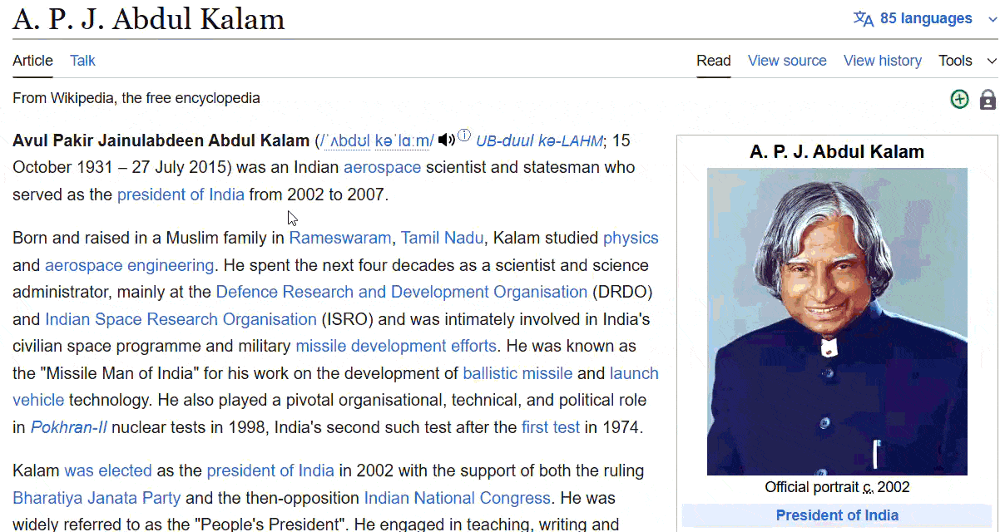

# 📖 Dictionary Anywhere (AutoHotkey)

A lightweight AutoHotkey script that gives you instant word definitions anywhere on your PC — in browsers, Word, PDFs, or any app.  
No extensions, no apps — just one hotkey.

## 📸 Demo
*(Highlight a word → press the shortcut → definition popup appears above the text)*

Here’s how it looks in action:



## ✨ Features
- Highlight any word → Press **Alt+D**
- Fetches definition online from [Free Dictionary API](https://dictionaryapi.dev/)
- Popup appears right above the highlighted word
- Stays visible until you **move the mouse**, **click**, or press **Esc**
- Works system-wide, in any application

## ⚙️ Requirements
- Windows
- [AutoHotkey v1.1](https://www.autohotkey.com/) (tested on 1.1.37.02)
- Internet connection

## 🚀 How to Use
1. Install AutoHotkey v1.1
2. Download `DictionaryAnywhere.ahk`
3. Double-click to run
4. Highlight a word anywhere → Press **Alt+D**

## 🎛 User Preferences
You can change the shortcut key to your own preference:  
- Open the `DictionaryAnywhere.ahk` script in any text editor.  
- Find the line near the top:

  ```ahk
  !d::   ; Hotkey = Alt+D

Replace `!d` with your own key combination:

- `^` = Ctrl  
- `+` = Shift  
- `!` = Alt  
- `#` = Windows Key
  
**Examples:**
- ``^+d`` → Ctrl+Shift+D  
- ``^!w::`` → Ctrl + Alt + W  
- ``F2::`` → F2 key  

Save the file and reload the script to apply your new hotkey.
## 📝 License
This project is licensed under the [MIT License](LICENSE).
